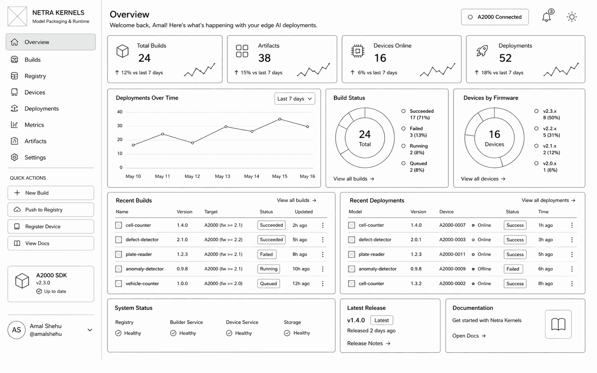
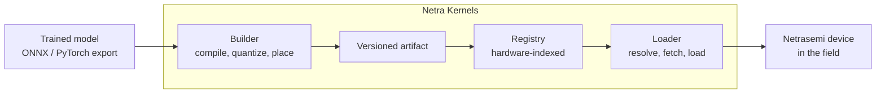
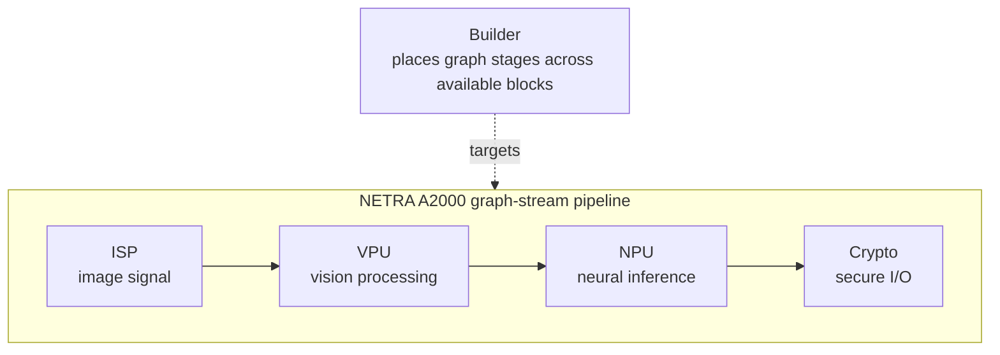

# Netra Kernels: Model Packaging and Runtime for Netrasemi Silicon

> **Company:** Netrasemi
> **Vertical:** Edge AI infrastructure
> **Type:** Prototype
> **Status:** Idea

---

## Project Summary

Netra Kernels is an open-source effort to make model deployment on Netrasemi silicon reproducible, versioned, and developer-friendly.

Netrasemi’s NETRA A2000 brings edge AI compute into a compact, power-efficient SoC with dedicated blocks for neural inference, vision processing, image signal processing, and secure I/O. As this ecosystem grows, developers will need a clean workflow for bringing trained models onto the hardware.

Netra Kernels proposes that workflow.

A trained model goes in. A versioned, hardware-matched deployment artifact comes out. The artifact can then be registered, resolved, loaded, updated, and rolled back safely on Netrasemi-powered devices.

The goal is simple: help developers, researchers, and product teams package and deploy models on Netrasemi silicon through a repeatable open-source toolchain.



*Concept of the Netra Kernels console: build status, the artifact registry, connected devices by firmware, and recent deployments in a single view.*

---

## Why This Matters

Edge AI is moving closer to where data is produced: hospitals, cameras, vehicles, factories, farms, labs, and public infrastructure.

These environments need:

* low latency
* offline operation
* predictable power use
* local data processing
* safer update workflows
* hardware-specific optimization

The hardware is the foundation. The developer experience around that hardware is what helps it become a platform.

Successful compute platforms usually grow around a few common patterns:

* a clear build workflow
* reusable artifacts
* versioned distribution
* hardware-aware runtime loading
* compatibility checks
* safe rollback

Netra Kernels brings these ideas to model deployment on Netrasemi silicon.

---

## What Netra Kernels Provides

Netra Kernels has three core parts:

1. **Builder**
   Compiles, quantizes, places, and packages a model for a Netrasemi hardware target.

2. **Registry**
   Stores versioned model artifacts indexed by chip, firmware, performance, and compatibility metadata.

3. **Loader**
   Runs on the device, resolves the correct artifact for the local hardware, loads it, and supports safe updates.

Together, these create a clean path from trained model to deployed edge workload.

---

## How It Works



A typical developer workflow:

```bash
netra build
netra push cell-counter
```

On the device:

```python
from netra import load

counter = load("cell-counter")
counts = counter(frame)
```

The device loader resolves the correct build for its chip and firmware version before loading the model.

---

## Core Components

### 1. Builder

The builder turns a model and manifest into a deployable artifact.

It handles:

* model import from ONNX or PyTorch export
* quantization
* target chip selection
* firmware compatibility constraints
* graph placement across available compute blocks
* latency and power budget checks
* artifact generation
* reproducible builds

Example manifest:

```yaml
name: cell-counter
version: 1.4.0

target:
  chip: a2000
  firmware: ">=2.1"

model: ./cell_counter.onnx
quantization: int8

pipeline:
  - { stage: capture, block: isp }
  - { stage: preprocess, block: vpu }
  - { stage: inference, block: npu }

io:
  input:
    name: frame
    shape: [1, 3, 1280, 1280]
    dtype: uint8
  output:
    name: counts
    shape: [4]
    dtype: int32

budget:
  latency_ms: 40
  power_w: 4.5
```

The manifest makes the build explicit. The same model, manifest, target, and toolchain version should produce the same deployment artifact.

---

### 2. Registry

The registry stores model artifacts with hardware and performance metadata.

Each artifact can include:

* model name
* semantic version
* target chip
* supported firmware range
* quantization format
* input and output schema
* latency benchmark
* power benchmark
* accuracy metadata
* build provenance
* rollback history

The registry answers a practical deployment question:

**Which artifact can safely run on this device?**

This makes compatibility visible before deployment instead of being discovered after installation.

---

### 3. Loader

The loader is a lightweight runtime client for Netrasemi-powered devices.

It detects the local hardware and firmware version, resolves the correct artifact from the registry, validates it, and loads it for execution.

The loader should support:

* chip and firmware resolution
* local artifact caching
* multiple model versions on one device
* staged rollout
* validation before activation
* rollback on regression

This is especially important for edge deployments where devices may be installed in clinical, industrial, automotive, or remote environments.

---

## Why This Is Technically Interesting

The A2000 is a heterogeneous edge AI SoC. A real deployment may involve more than running a neural network on one accelerator.

A workload can include:

* image capture
* image signal processing
* preprocessing
* vision operations
* neural inference
* post-processing
* secure output

These stages may map to different hardware blocks.



This makes Netra Kernels more than a model packaging tool. It is also a hardware-aware compilation and placement workflow.

The builder should work with Netrasemi’s compiler, SDK, and runtime stack. It should extend the platform, not replace it.

---

## Example Use Case: Cell Counter

A lab uses a microscope camera to count cells in a chamber with four grids.

The pipeline:

1. The camera frame enters the device.
2. The ISP handles image input.
3. The VPU handles grid detection and preprocessing.
4. The NPU runs the counting model.
5. The model returns four cell counts.
6. The application calculates concentration from the total count.

The developer writes the model and manifest. Netra Kernels handles packaging, hardware matching, deployment, and rollback.

Example runtime code:

```python
from netra import load

counter = load("cell-counter")

counts = counter(frame)
concentration = sum(counts) / CHAMBER_VOLUME_UL
```

Updating the model:

```bash
netra push cell-counter@1.5.0
```

A device can pull the new version, validate it, and roll back automatically if the new artifact fails validation.

---

## What Changes

| Area             | Conventional Workflow          | With Netra Kernels                 |
| ---------------- | ------------------------------ | ---------------------------------- |
| Build definition | Manual notes and scripts       | Declarative manifest               |
| Quantization     | Per-model tuning               | Reproducible build setting         |
| Compilation      | Target-specific process        | Builder-driven artifact generation |
| Compatibility    | Checked manually               | Chip and firmware indexed          |
| Distribution     | Copied binary or custom update | Versioned registry                 |
| Deployment       | Device-specific integration    | Runtime artifact resolution        |
| Updates          | Manual replacement             | Staged rollout                     |
| Failure handling | Manual recovery                | Rollback support                   |

---

## Prototype Goals

The prototype should prove the full model-to-device workflow.

Goals:

1. Define the build manifest format.
2. Build a CLI that packages one sample model.
3. Generate a versioned deployment artifact.
4. Store artifacts in a hardware-aware registry.
5. Build a lightweight runtime loader.
6. Resolve artifacts by chip and firmware version.
7. Demonstrate deployment on A2000 hardware.
8. Demonstrate update and rollback using a second model version.

---

## Milestones

| Milestone |       Timeline | Output                                         |
| --------- | -------------: | ---------------------------------------------- |
| M1        |   Weeks 1 to 4 | Manifest format and builder CLI                |
| M2        |   Weeks 5 to 8 | Versioned registry with hardware indexing      |
| M3        |  Weeks 9 to 12 | Runtime loader with compatibility resolution   |
| M4        | Weeks 13 to 16 | End-to-end A2000 demo with update and rollback |

---

## How to Contribute

Netra Kernels is a good fit for contributors interested in edge AI systems, model compilers, embedded runtimes, and developer tooling.

Useful skills include:

* embedded systems
* cross-compilation toolchains
* ONNX, TVM, MLIR, or similar compiler stacks
* quantization and inference optimization
* heterogeneous graph partitioning
* model artifact versioning
* package registry design
* Python SDK and CLI development
* edge deployment workflows

---

## Getting Started

1. Read Netrasemi’s technology overview and available A2000 architecture references.
2. Review the initial manifest proposal.
3. Try packaging a small ONNX model.
4. Test whether the manifest can describe the model’s target, inputs, outputs, quantization, and runtime budget.
5. Contribute improvements to the manifest, builder, registry, or loader design.

The manifest is only useful if it works across multiple real models. Early contributors can help validate and improve the format.

---

## Current Contributors

| Name       | GitHub                                     | Role                   |
| ---------- | ------------------------------------------ | ---------------------- |
| Amal Shehu, VitalView AI | [@amalshehu](https://github.com/amalshehu) | Initiating contributor |

---

## Resources

### Netrasemi and Silicon References

* [Netrasemi Technology Overview](../technology-overview.md)
* [Indian Startup Builds Full-Stack Edge AI Chips Using In-House IP, EE Times](https://www.eetimes.com/indian-startup-builds-full-stack-edge-ai-chips-using-in-house-ip/)
* [Netrasemi Completes Silicon Bring-Up of India's First 12nm Edge AI Chip NETRA A2000, Elets CIO](https://cio.eletsonline.com/news/netrasemi-completes-silicon-bring-up-of-indias-first-12nm-edge-ai-chip-netra-a2000/76145/)
* [India AI Chip Ambitions Grow with Netrasemi A2000 Edge Processor, AI CERTs](https://www.aicerts.ai/news/india-ai-chip-ambitions-grow-with-netrasemi-a2000-edge-processor/)

### Technical Foundations

* [TVM: An Automated End-to-End Optimizing Compiler for Deep Learning](https://arxiv.org/abs/1802.04799)
* [MLIR: A Compiler Infrastructure for the End of Moore's Law](https://arxiv.org/abs/2002.11054)
* [Glow: Graph Lowering Compiler Techniques for Neural Networks](https://arxiv.org/abs/1805.00907)
* [Quantization and Training of Neural Networks for Efficient Integer-Arithmetic-Only Inference](https://arxiv.org/abs/1712.05877)
* [Device Placement Optimization with Reinforcement Learning](https://arxiv.org/abs/1706.04972)
* [ONNX](https://github.com/onnx/onnx)

---

*Part of Beyond Borders by The Purple Movement.*
